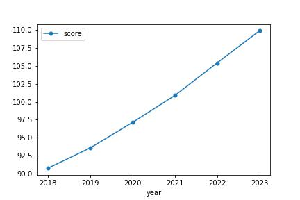
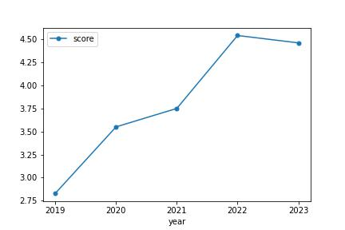

# beijing-household
北京积分落户分析

All data is from public web site.
The data of 2020 is from `http://fuwu.rsj.beijing.gov.cn/nwesqintegralpublic/settleperson/settlePersonTable`

## 政策相关
每年录取名额6000人，按积分情况择优录取，由于存在同分数情况，本着公平公正原则，划线可能会导致最终录取名额超过6000人

## 分析

## 分析结论
